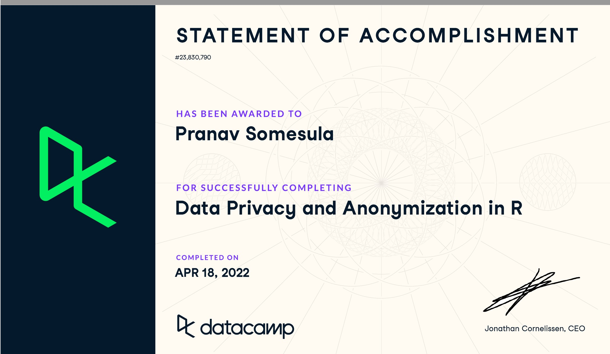

```{r, out.width = "50%", fig.cap = "certificate"}
library(knitr)


```
# Setup
```{r}
library(dplyr)
library(tidyverse)
library(reshape2)
library(knitr)
dataCOVID2 <- tribble(
  ~Date, ~Mask, ~NoMask, 
  "7/13/2020", 22.8, 9.4,
  "7/14/2020", 19.6, 9.2,
  "7/15/2020", 20, 9.7,
  "7/16/2020", 19.8, 9.9,
  "7/17/2020", 19.7, 9.8,
  "7/18/2020", 20.2, 9.6,
  "7/19/2020", 20.2, 9.3,
  "7/20/2020", 20.4, 8.8,
  "7/21/2020", 21, 8.5,
  "7/22/2020", 20.7, 8.6,
  "7/23/2020", 19.7, 8.5,
  "7/24/2020", 20.3, 9.3,
  "7/25/2020", 19.8, 9.9,
  "7/26/2020", 19.4, 10,
  "7/27/2020", 18.6, 9.8,
  "7/28/2020", 16.8, 9.7,
  "7/29/2020", 16.5, 9.7,
  "7/30/2020", 16.4, 9.8,
  "7/31/2020", 16.4, 9.3,
  "8/1/2020", 16, 8.9,
  "8/2/2020", 15.8, 8.8,
  "8/3/2020", 15.9, 9,
)
attach(dataCOVID2)
```
# Visualiziation
```{r}
# Failed attempts at visualization
# ggplot(dataCOVID, aes(Date)) +
#   geom_line(aes(y = Mask, colour = "Green")) +
#   geom_line(aes(y = NoMask, colour = "Yellow")) +
#   scale_colour_manual(values = c("green", "yellow"), name = "Kansas COVID-19 7-Day Rolling Average of Daily Cases/Per 100K Population", labels = c("Mask", "NoMask")) +
#   ylab("COVID")
# 
# ggplot(dataCOVID2, aes(x = Date, y = value, color = variable)) +
#   geom_point(aes(y=Mask, col = "Mask")) +
#   geom_point(aes(y = NoMask, col = "NoMask")) +
#   labs(title = "Kansas COVID-19 7-Day Rolling Average of Daily Cases/Per 100K Population", x = "Date", y = "Avg cases per 100k people") +
#   theme(axis.text.x = element_text(angle = 50))

ggplot(dataCOVID2, aes(x = Date, y = value, color = variable, group =1)) +
  geom_point(aes(y = Mask, col = "Mask")) +
  geom_line(aes(y = Mask, col = "Mask")) + 
  geom_point(aes(y = NoMask, col = "NoMask")) +
  geom_line(y = NoMask, col = "Blue") +
  labs(title = "Kansas COVID-19 7-Day Rolling Average of Daily Cases/Per 100K Population", subtitle = "Mask counties vs. No-Mask Mandate counties", caption = "Source: Kansas Department of Health and Environment", x = "Date", y = "Avg cases per 100k people") +
  theme(axis.text.x = element_text(angle = 50))
  


```
### Questions

In the original visualization the graph is misleading because it purposely adds noise to the Mask and NoMask data by having unequal scales. There are two scales that are on the different sides of the graph any by having this weird scale this causes the lines from both graphs to intersect which does not allow the reader to clearly see how effective masking is in reducing cases. In my visualization, we can see the stark reduction in cases from around 23 to 16 where as the no mask line roughly hovers around the same value (9). Such misinformation through graphs is important to combat as it could lead to people doing behavior that's harmful to society (such as not wearing a mask during the pandemic peak) based on misrepresented data.

# Summary of video - Ted Talk

It was interesting to see how the speaker Joy compared viruses to algorithm bias in terms of how fast they can spread bias or "disease". I never realized the wide spread implications of having bias in our technology. The problem is having proper training sets that include everyone and personally this explains to me why there is such a big push for diversity in tech. Through diversity implicit biases of one subpopulation can be corrected for and allow unbiased software to develop. The aforementioned implications is even more critical when entitites such as police and the government use it for decision with long term consequences such as prison sentences. We often see China as a surviellence state but the video made me question how much the government really watches secretly. Furthermore, it is important to go through the current software now and undo biases not just build new software. That we mishaps like Google identifying a Black individual as an ape will not happen. This might be challenging due to the blackbox nature of machine learning however it is our responsibility to make sure these algorithms that touch every facet of our life to be representative of the world they are helping.


